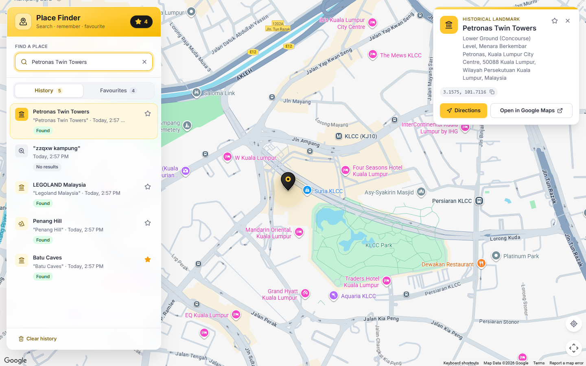
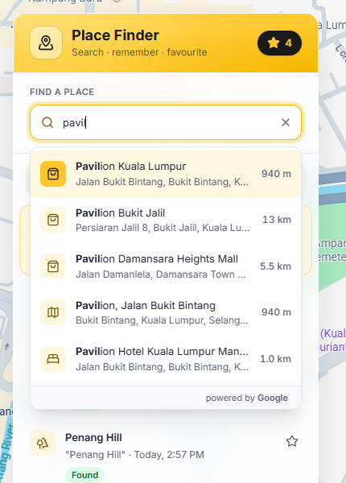
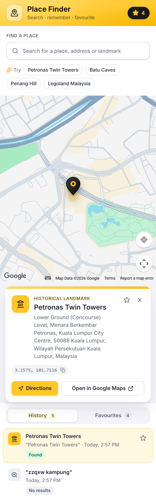
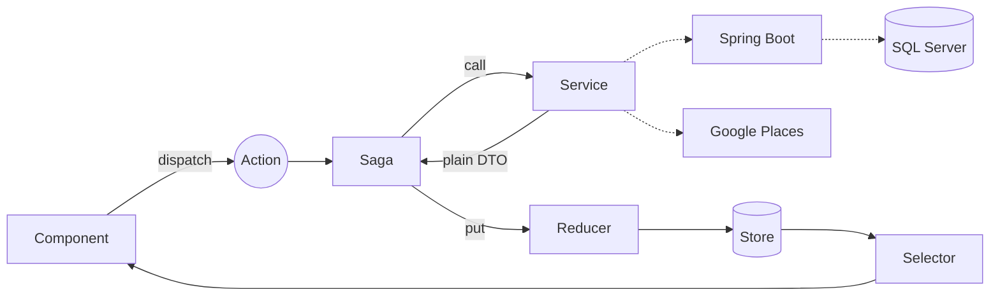

# Place Finder

Search any place with **Google Places**, see it on the map, keep **every search** in Redux, and star **favourites** saved to **SQL Server** through a **Spring Boot** API.

**React 19 · TypeScript · Redux Toolkit + Redux-Saga · Tailwind CSS 4 · Google Places API (New) · Spring Boot 4 · SQL Server 2022**



<table>
  <tr>
    <td align="center"><br><sub>Autocomplete: bold match, category, distance</sub></td>
    <td align="center"><br><sub>Mobile layout</sub></td>
  </tr>
</table>

---

## Requirements → where to look

| # | Requirement | Done with | Code |
|---|---|---|---|
| 1 | Autocomplete from the Google API | Accessible combobox on **Places API (New)** with session tokens | [SearchBox](frontend/src/features/search/components/SearchBox.tsx) · [placesService](frontend/src/services/google/placesService.ts) |
| 2 | Redux stores results and shows **all** searches | Every attempt is recorded: Found / No results / Error. Clicking one shows it again with **no new Google call** | [history slice](frontend/src/features/history/slice.ts) · [HistoryPanel](frontend/src/features/history/components/HistoryPanel.tsx) |
| 3 | One middleware | **Redux-Saga only** (`thunk: false`) | [store](frontend/src/app/store.ts) · [search saga](frontend/src/features/search/saga.ts) |
| 4 | Bootstrap / Tailwind / MUI | **Tailwind 4**, all colours and sizes in one token file | [theme.css](frontend/src/styles/theme.css) |
| 5 | Usable, scalable structure | Feature folders, one service per external system, typed state, 105 tests | [features/](frontend/src/features) |
| ★ | HOC, custom hooks, render props | `withGoogleMaps` HOC · 7 custom hooks · `SuggestionList` and `AsyncView` render props | *Patterns used* (below) |
| ★ | Favourite via Spring Boot + MSSQL | REST API, Flyway, optimistic toggle with rollback | [backend](backend/src/main/java/com/placefinder/favourite) · [favourites saga](frontend/src/features/favourites/saga.ts) |

## Highlights

- **No stale results**: `takeLatest` + `delay(300)` debounces typing *and* cancels slower, older requests.
- **Fly-to camera**: zoom out, glide, zoom in, landing the place in the visible part of the map ([camera.ts](frontend/src/features/place/utils/camera.ts), unit-tested).
- **Optimistic favourites**: the star updates instantly and rolls back with a toast if the API fails.
- **Works when parts fail**: backend down? Search still works. No Google key? A clear banner, not a crash.
- **Accessible**: WAI-ARIA combobox, full keyboard use (↑ ↓ Enter Esc, `/` to search), AA contrast, reduced-motion support.
- **Extras**: Locate me, distance in km, category icons, one-click "Try" examples, history saved across reloads.

## Architecture



**Rules:** Google objects never enter Redux · components never call Google or the API · state is read only through selectors.

## Run it (Windows · PowerShell)

Needs Node 20+, Java 21, Docker Desktop. No Maven install needed (wrapper included).

```powershell
Copy-Item .env.example .env                    # set MSSQL_SA_PASSWORD
docker compose up -d                           # SQL Server + database

Copy-Item backend\src\main\resources\application-local.example.yml backend\src\main\resources\application-local.yml
cd backend; .\mvnw.cmd spring-boot:run         # http://localhost:8080/swagger-ui.html

cd ..\frontend
Copy-Item .env.example .env.local              # set VITE_GOOGLE_MAPS_API_KEY
npm install; npm run dev                       # http://localhost:5173
```

<details>
<summary><b>Getting a Google Maps key</b></summary>

1. Google Cloud Console → new project → enable billing (there is a free monthly allowance).
2. Enable **Maps JavaScript API** and **Places API (New)**.
3. Credentials → Create API key → restrict to `http://localhost:5173/*` and those two APIs.

The legacy `Autocomplete` widget from Google's example isn't available to new customers since March 2025, so this app uses Places API (New) with one session token per typing session (billed as one session).
</details>

## API · `/api/v1/favourites`

| Method | Path | Result |
|---|---|---|
| GET | `/` | `200` list, newest first |
| PUT | `/{placeId}` | `201` created · `200` already existed · `400` ProblemDetail |
| DELETE | `/{placeId}` | `204`, also when missing |

## Tests

```powershell
cd frontend; npm test        # 89 tests: reducers, sagas, components, camera maths
cd backend;  .\mvnw.cmd verify   # 16 tests: service, controller, real SQL Server (Testcontainers)
```

<details>
<summary><b>Patterns used</b></summary>

| Pattern | Where | Why |
|---|---|---|
| HOC | [`withGoogleMaps`](frontend/src/shared/hoc/withGoogleMaps.tsx) | Loading / missing-key / failure handled once for map and search |
| Custom hooks | [`usePlaceSearch`](frontend/src/features/search/hooks/usePlaceSearch.ts), [`useListNavigation`](frontend/src/shared/hooks/useListNavigation.ts), [`useFavourite`](frontend/src/features/favourites/hooks/useFavourite.ts), [`useMapFocus`](frontend/src/features/place/hooks/useMapFocus.ts), [`useOnClickOutside`](frontend/src/shared/hooks/useOnClickOutside.ts), [`useMediaQuery`](frontend/src/shared/hooks/useMediaQuery.ts), [`useSearchShortcut`](frontend/src/features/search/hooks/useSearchShortcut.ts) | Logic out of components; components stay markup |
| Render props | [`SuggestionList`](frontend/src/features/search/components/SuggestionList.tsx), [`AsyncView`](frontend/src/shared/components/AsyncView.tsx) | Shared ARIA / loading-empty-error logic; caller decides the look |
</details>

<details>
<summary><b>Decisions & trade-offs</b></summary>

- **Saga over Thunk**: cancellation and debounce are built in, and generators are easy to test.
- **Tailwind**: one `@theme` token file; the gold accent comes with partner tokens so every text/background pair passes WCAG AA.
- **Flyway owns the schema**; Hibernate only validates it (`ddl-auto: validate`).
- **No login**: favourites are global for this demo. Next step: auth plus a `user_id` column.
- **History lives in localStorage** (newest 100), so it's per device.
- **Next**: Playwright E2E tests, CI pipeline, a "nearby places" feature folder.
</details>

<details>
<summary><b>Project structure</b></summary>

```
frontend/src/
  app/         store (saga only), root saga, providers, layout
  services/    google/ (placesService, mappers) · api/ (favouritesApi) · browser/ (geolocation)
  features/    search · place · history · favourites · location · ui
  shared/      components, hoc, hooks, utils
backend/src/main/java/com/placefinder/
  favourite/   controller → service → repository · entity · mapper · dto
  common/      GlobalExceptionHandler (ProblemDetail)
  config/      CORS, OpenAPI, Clock
```
</details>
