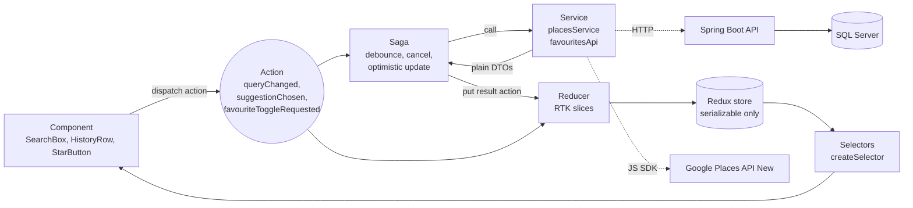

# Place Finder

Type a place, pick a Google Places suggestion, and see it on the map. **Every search you try** (found, no results or error) is kept in Redux and listed in **Search history**. Star a place to save it as a **favourite**; that calls a Spring Boot API which stores it in **SQL Server**.

| Layer | Tech |
|---|---|
| Frontend | React 19, Vite, TypeScript (strict), Redux Toolkit, **Redux-Saga**, Tailwind CSS 4, `@vis.gl/react-google-maps`, lucide-react |
| Google | Maps JavaScript API + **Places API (New)**: `AutocompleteSuggestion`, `AutocompleteSessionToken`, `Place.fetchFields` |
| Backend | Java 21, Spring Boot 4.1, Spring Data JPA, Bean Validation, Flyway, springdoc (Swagger UI) |
| Database | Microsoft SQL Server 2022 (Docker) |
| Tests | Vitest + React Testing Library (82 tests); JUnit 5 + Mockito + MockMvc + Testcontainers (16 tests) |

### Highlights

- **Fly-to camera**: a nearby place gets one calm glide. A far one gets three overlapping phases: zoom out, glide across while zoomed out, zoom in. The map only travels at low zoom, where tiles are large and already loaded, so no blank tiles flash past (pure Web Mercator maths in [camera.ts](frontend/src/features/place/utils/camera.ts), vector rendering with in-between zoom levels). The place lands in the middle of the *visible* map, not under the floating panels. It jumps instead when the OS asks for reduced motion.
- **Rich place card**: category, "Saved …" and distance chips, Directions, Copy coordinates and Open in Google Maps. When Google has a photo, it shows as a banner with the author credit Google requires; without one the card stays compact.
- **Favourites show full details**: the backend stores only name, address and point. A [place saga](frontend/src/features/place/saga.ts) shows that at once, then fills in category, viewport and link from a past search in history (free) or from Google (once per session, cached). Late answers for a place you already left are ignored.
- **Smart suggestions**: a category icon (mall, food, park, airport…), the distance, the matched text in bold, and "powered by Google".
- **Locate me**: a self-contained `location` feature (slice + saga + service). It shows a blue dot, biases suggestions around you, and adds "x km from you" to the card and favourites.
- **One-click demo**: "Try" chips (Petronas Twin Towers, Batu Caves…) run the real flow; <kbd>/</kbd> or <kbd>Ctrl</kbd>+<kbd>K</kbd> focuses search from anywhere.
- **Motion with purpose**: the pin drops in with a ripple, favourite stars grow on hover, rows fade in one after another and loading shows a shimmer. All CSS, no animation library, and switched off for users who turn on reduced motion in their system settings.

> **Screenshots:** add `docs/screenshot-desktop.png` and `docs/screenshot-mobile.png` after running the app with a Google key.

---

## Assessment requirements

| # | Requirement | How it is met | Where |
|---|---|---|---|
| 1 | Textbox autocompletes with results from the Google API | Accessible combobox calling **Places API (New)**: `AutocompleteSuggestion.fetchAutocompleteSuggestions()` for suggestions, `Place.fetchFields()` for details | [SearchBox.tsx](frontend/src/features/search/components/SearchBox.tsx), [placesService.ts](frontend/src/services/google/placesService.ts) |
| 2 | Redux stores results and shows all searches the user tries | RTK slices `search`, `place`, `history`, `favourites`, `ui`. Every attempt becomes a history entry with a status chip (Found / No results / Error). Clicking an entry re-shows the stored result with **no new Google call** | [history/slice.ts](frontend/src/features/history/slice.ts), [HistoryPanel.tsx](frontend/src/features/history/components/HistoryPanel.tsx) |
| 3 | One Redux middleware | **Redux-Saga only**. RTK's default thunk is switched off (`thunk: false`) | [store.ts](frontend/src/app/store.ts), [rootSaga.ts](frontend/src/app/rootSaga.ts), [search/saga.ts](frontend/src/features/search/saga.ts) |
| 4 | Bootstrap, Tailwind or Material UI | **Tailwind CSS 4**; all design tokens in one `@theme` block | [theme.css](frontend/src/styles/theme.css) |
| 5 | Friendly, usable, scalable structure | Feature folders on both sides, one service per external system, typed state, selectors, tests | [frontend/src/features](frontend/src/features), [backend/…/favourite](backend/src/main/java/com/placefinder/favourite) |
| Opt | ES6+, HOC, custom hooks, render props, hooks, functional components | TypeScript (ES2022), function components only; see [Patterns](#patterns-used) | below |
| Opt | Favourite via Spring Boot API, saved in a relational DB (MSSQL preferred) | REST API + SQL Server 2022 + Flyway; optimistic toggle with rollback from a saga | [FavouriteController.java](backend/src/main/java/com/placefinder/favourite/FavouriteController.java), [favourites/saga.ts](frontend/src/features/favourites/saga.ts) |

---

## 5-minute setup (Windows, PowerShell)

Needs **Node 20+**, **Java 21** and **Docker Desktop**. Maven is not needed (the wrapper `mvnw.cmd` downloads it).

```powershell
# 1. Database: SQL Server 2022 in Docker
Copy-Item .env.example .env
notepad .env                        # set MSSQL_SA_PASSWORD (8+ chars, upper, lower, digit, symbol)
docker compose up -d                # starts SQL Server and creates the place_finder database

# 2. Backend on http://localhost:8080
Copy-Item backend\src\main\resources\application-local.example.yml backend\src\main\resources\application-local.yml
notepad backend\src\main\resources\application-local.yml   # same password as .env
cd backend
.\mvnw.cmd spring-boot:run          # Flyway creates the table on first start
cd ..

# 3. Frontend on http://localhost:5173 (new terminal)
cd frontend
Copy-Item .env.example .env.local
notepad .env.local                  # set VITE_GOOGLE_MAPS_API_KEY
npm install
npm run dev
```

- If port 1433 is taken, set `MSSQL_PORT=1434` in `.env` and use `localhost:1434` in `application-local.yml`.
- Instead of `application-local.yml` you can set `DB_URL`, `DB_USERNAME`, `DB_PASSWORD` environment variables.
- Swagger UI: http://localhost:8080/swagger-ui.html · Health: http://localhost:8080/actuator/health
- In development the Vite server proxies `/api` to `:8080`, so the browser never needs CORS.

**Without a backend** the app still searches and keeps history; only the Favourites tab shows *"Favourites are offline right now. Search still works."* with a Retry button.
**Without a Google key** the app shows a banner explaining how to add one instead of crashing.

### Google Cloud setup

1. Create a project at https://console.cloud.google.com and **enable billing** (there is a monthly free credit).
2. Enable **Maps JavaScript API** and **Places API (New)**.
3. *APIs & Services → Credentials → Create credentials → API key.*
4. Restrict the key: *Application restriction* = HTTP referrers → `http://localhost:5173/*`; *API restriction* = the two APIs above.
5. Put it in `frontend/.env.local` as `VITE_GOOGLE_MAPS_API_KEY=…` and restart `npm run dev`.

`VITE_GOOGLE_MAP_ID=DEMO_MAP_ID` works for development (Advanced Markers need a Map ID).

> **Why not the widget from the linked Google example?** Since 1 March 2025 the legacy `google.maps.places.Autocomplete` / `AutocompleteService` are not available to new Google Cloud customers. This app uses the **Places API (New)** classes through the Maps JavaScript API, and builds its own combobox so results go through Redux.

**Session tokens (billing):** one `AutocompleteSessionToken` is created per typing session and sent with every suggestion request. The session ends when `fetchFields` is called on the chosen `Place` (from `placePrediction.toPlace()`), and the next keystroke starts a new token. Google then bills the suggestions and the details as one session. Only the 8 fields the UI shows are requested (`photos` is the most expensive; remove it from `PLACE_FIELDS` in [placesService.ts](frontend/src/services/google/placesService.ts) and the card falls back to a gradient). Suggestions send an `origin`, so each one includes `distanceMeters` at no extra cost.

---

## Architecture



**Rules the code follows**

1. **Google objects never enter Redux.** `placesService` is the only file that touches `google.maps.places`; [mappers.ts](frontend/src/services/google/mappers.ts) turns `Place` / `PlacePrediction` into plain DTOs. RTK's serializable check stays on.
2. **Components never call Google or the backend.** They dispatch actions; sagas call services; reducers store results.
3. **Components read state only through selectors** (`features/*/selectors.ts`); derived lists use `createSelector`.
4. Every async flow has `idle | loading | succeeded | failed` and a friendly message. Raw Google/HTTP errors are never shown ([serviceError.ts](frontend/src/services/serviceError.ts)).

### State shape

```ts
{
  search:     { query, suggestions, status, error, isOpen, activeIndex }
  place:      { selected: PlaceDetails | null, status, error }
  history:    { entries: SearchEntry[] /* newest first, max 100 */, selectedId }
  favourites: EntityState<Favourite, placeId> & { status, error, pendingIds }
  location:   { position: LatLng | null, status, error }
  ui:         { toasts, googleKeyRejected }
}
```

### Why Redux-Saga

Typing is the hard part of autocomplete. In [search/saga.ts](frontend/src/features/search/saga.ts):

```ts
takeLatest([queryChanged, suggestionChosen, searchSubmitted, searchCleared], fetchSuggestionsFlow)
// fetchSuggestionsFlow: yield delay(300) → yield call(placesService.fetchSuggestions, query)
```

`takeLatest` **cancels the previous run** whenever a new action arrives. While you type, the old run is cancelled inside `delay(300)`, which gives a **debounce**. If a request is already in flight, it is cancelled too, so a slow old response **can never overwrite a newer one** (a test proves this). Choosing or clearing also cancels a pending fetch.

The same model gives the **optimistic favourite toggle** in [favourites/saga.ts](frontend/src/features/favourites/saga.ts): update the store at once, call the API, roll back and show a toast on failure, and ignore a second click while the first is pending. Sagas are generators, so tests can drive them with a real store and mocked services.

History is persisted by a small saga (`takeEvery([entryAdded, entryRemoved, historyCleared])` → `localStorage['placeFinder.history.v1']`), and loaded into `preloadedState` at startup with shape validation. No redux-persist.

### Why Tailwind

Utility classes keep each component's styling next to its markup, and Tailwind 4's `@theme` turns the design tokens (gold & black accent, 13 px text, 12 px card radius, status chip colours) into utilities like `bg-app-primary` or `text-label`. One token file ([theme.css](frontend/src/styles/theme.css)) changes the look everywhere; the move from teal to gold was almost entirely a token change. Because yellow is light, it comes with partner tokens: `app-on-primary` (black text on yellow) and `app-ink` (dark gold text on white), so every pairing passes WCAG AA, and the keyboard focus ring is dark rather than yellow. Statuses get colour from one component ([StatusChip.tsx](frontend/src/shared/components/StatusChip.tsx)), never by hand.

---

## Patterns used

| Pattern | Where | Why it is there |
|---|---|---|
| **HOC** `withGoogleMaps(Component, { skeleton, layout })` | [withGoogleMaps.tsx](frontend/src/shared/hoc/withGoogleMaps.tsx), wraps `SearchBox` and `PlaceMap` | Loading skeleton, missing-key, key-rejected and load-failed states are written once |
| **Custom hook** `usePlaceSearch()` | [usePlaceSearch.ts](frontend/src/features/search/hooks/usePlaceSearch.ts) | All combobox state and handlers (`onChange`, `onKeyDown`, `choose`); `SearchBox` is just markup |
| **Custom hook** `useListNavigation()` | [useListNavigation.ts](frontend/src/shared/hooks/useListNavigation.ts) | ↑ ↓ Home End with wrap-around, reusable for any list |
| **Custom hook** `useFavourite(place)` | [useFavourite.ts](frontend/src/features/favourites/hooks/useFavourite.ts) | `{ isFavourite, isPending, toggle }` |
| **Custom hook** `useMapFocus()` | [useMapFocus.ts](frontend/src/features/place/hooks/useMapFocus.ts) | `fitBounds(viewport)` or `panTo` + zoom 15 when the selected place changes |
| **Custom hook** `useOnClickOutside()` | [useOnClickOutside.ts](frontend/src/shared/hooks/useOnClickOutside.ts) | Closes the dropdown |
| **Custom hook** `useMediaQuery()` | [useMediaQuery.ts](frontend/src/shared/hooks/useMediaQuery.ts) | `useSyncExternalStore` over `matchMedia`; drives layout insets and reduced motion |
| **Custom hook** `useSearchShortcut()` | [useSearchShortcut.ts](frontend/src/features/search/hooks/useSearchShortcut.ts) | <kbd>/</kbd> and <kbd>Ctrl</kbd>+<kbd>K</kbd> focus search, but never while typing in another field |
| **Render props** `<SuggestionList renderItem>` | [SuggestionList.tsx](frontend/src/features/search/components/SuggestionList.tsx) | The list owns ARIA roles, ids and mouse wiring; the caller decides how a row looks |
| **Render props** `<AsyncView>{(data) => …}</AsyncView>` | [AsyncView.tsx](frontend/src/shared/components/AsyncView.tsx) | Same loading / empty / error+retry handling for the History and Favourites tabs |

---

## Backend API (base `/api/v1`)

| Method | Path | Body | Success | Errors |
|---|---|---|---|---|
| GET | `/favourites` | — | `200` list, newest first | — |
| PUT | `/favourites/{placeId}` | `{ name, address, latitude, longitude }` | `201` created (with `Location`), `200` already existed (idempotent) | `400` ProblemDetail with `errors[]` |
| DELETE | `/favourites/{placeId}` | — | `204`, also when it did not exist | — |

```json
{ "placeId": "ChIJ...", "name": "Pavilion Kuala Lumpur", "address": "168 Jalan Bukit Bintang, ...",
  "latitude": 3.149, "longitude": 101.7133, "createdAt": "2026-10-06T02:05:00Z" }
```

Validation: `placeId` ≤ 255 · `name` not blank, ≤ 255 · `address` ≤ 500 · `latitude` −90…90 · `longitude` −180…180.
Errors are RFC 9457 `ProblemDetail`s from one [GlobalExceptionHandler](backend/src/main/java/com/placefinder/common/GlobalExceptionHandler.java).

**Layers** (package by feature, [`com.placefinder.favourite`](backend/src/main/java/com/placefinder/favourite)): Controller (HTTP only) → Service (`@Transactional`, idempotent upsert, delete-if-exists) → Repository (`JpaRepository` with derived queries) · Mapper (entity ↔ record DTOs) · Entity. The schema is owned by Flyway ([V1__create_favourite_place.sql](backend/src/main/resources/db/migration/V1__create_favourite_place.sql)); Hibernate runs with `ddl-auto: validate`.

There is no login, so **favourites are global** in this demo. The next step would be authentication plus a `user_id` column (and a unique key on `user_id, place_id`).

---

## Tests

```powershell
cd frontend; npm test; npm run lint; npm run build
cd backend;  .\mvnw.cmd verify
```

**Frontend (Vitest, 82 tests)**
- Fly-to camera maths: lands exactly on target, zooms out only for far trips, takes the short way across 180°, and Mercator project/unproject round-trips.
- Location saga: stores the position, explains a blocked permission, and biases suggestions once located.
- Reducers: every slice, including the history cap of 100, newest first, `entrySelected`, and favourites optimistic add/remove/rollback.
- Sagas (real store, mocked services): the debounce sends only the last query; **a slow older response never overwrites a newer one**; fewer than 2 characters makes no request; chosen loads details and adds a history entry; submitted with no suggestions adds a `no-results` entry; favourite toggle success, rollback and toast, and a second click ignored while pending; raw errors are never shown.
- Components: `SearchBox` keyboard flow (type → ↓ → Enter → the card shows the name, focus stays in the input), Esc closes and then clears, Retry; `HistoryPanel` empty and filled states, re-select with no Google call, inline clear confirmation.
- Selectors (memoized history list), localStorage load/save with bad data, mappers, env validation, date formatting.

**Backend (`mvn verify`, 16 tests)**
- `FavouriteServiceTest` (Mockito): create vs already exists, delete missing, list mapping.
- `FavouriteControllerTest` (`@WebMvcTest`): 200 / 201 + `Location` / 200 / 204, and 400 ProblemDetail with field errors.
- `FavouriteRepositoryIT` and `FavouriteApiIT` (**Testcontainers SQL Server 2022**): Flyway + schema validation, Unicode names, ordering, unique constraint, and a full PUT/GET/DELETE round trip. Skipped automatically when Docker is not available.

---

## Trade-offs and next steps

- **Custom combobox instead of Google's `PlaceAutocompleteElement`.** More code, but every result flows through Redux (requirement 2), we control the keyboard and ARIA behaviour, and the debounce/cancel logic is testable.
- **History lives in the browser** (localStorage, 100 entries). It is per device. Moving it to the backend would be one more feature folder and table.
- **Favourites are global** (no auth): add Spring Security + `user_id`.
- **Concurrent PUTs of the same new place** could hit the unique constraint; the API answers `409` and the UI already prevents double clicks with `pendingIds`.
- **Location bias**: suggestions are biased to the selected place (or the default centre) within 50 km, and limited by `VITE_PLACES_REGION_CODES` (blank means worldwide).
- **Desktop layout floats panels over a full-bleed map**; on small screens the same panel uses `display: contents`, so search, map, card and lists stack without duplicated markup. The card sits *below* the map on mobile so Google's logo and attribution are never covered.
- Next: E2E tests (Playwright) with a stubbed Google SDK, a "nearby places" feature folder, CI running `npm test` and `mvn verify`.

---

## Repository layout

```
├─ docker-compose.yml          SQL Server 2022 + init container
├─ docker/mssql/init.sql       CREATE DATABASE place_finder
├─ frontend/src
│  ├─ app/                     store (saga, thunk off), rootSaga, providers, layout
│  ├─ config/env.ts            validates VITE_* once
│  ├─ services/                google/ (placesService, mappers, authFailure), api/ (httpClient, favouritesApi)
│  ├─ features/                search · place · history · favourites · location · ui  (slice, saga, selectors, components, hooks, __tests__)
│  ├─ shared/                  components, hoc, hooks, utils, copy (all UI text)
│  └─ styles/                  theme.css (tokens), index.css
└─ backend/src/main/java/com/placefinder
   ├─ config/                  CORS, OpenAPI, Clock
   ├─ common/                  GlobalExceptionHandler (ProblemDetail)
   └─ favourite/               controller, service, repository, entity, mapper, dto/
```
